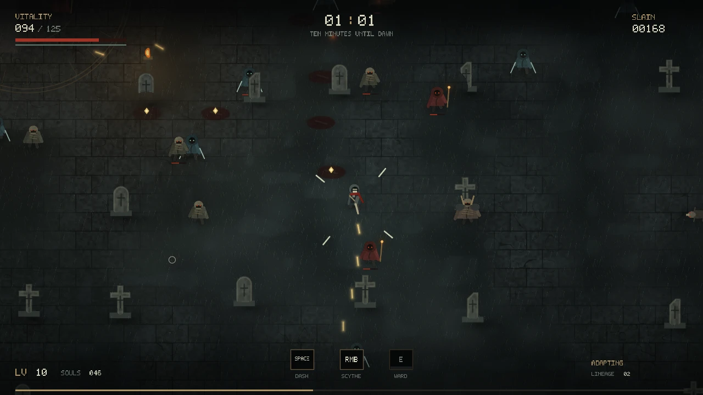

# NOCTURNE
## The Hollow Remembers

**[Play in your browser](https://samg-coder.github.io/nocturne/)** · [GPU checks](https://samg-coder.github.io/nocturne/tests/browser.html)

A dark, top-down survival game with an online-trained movement predictor and evolving enemy tactics. Survive ten minutes in the hollow. Shoot, cut through crowds, collect souls and choose relics. The enemies retain their learned memory between runs.

**All authored game simulation, rendering, HUD, menus, neural training, enemy evolution and audio synthesis are CUDA `.cu` source.** JavaScript is the browser transport: it allocates WebGPU resources, dispatches kernels, delivers controls, presents the completed image, plays the CUDA-generated sounds and saves memory. There is no Three.js scene, JavaScript enemy simulation, chat API, pretrained model or hand-authored WGSL game shader.

This is a first playable build, not a claim of production readiness. The kernels were compiled and exercised on CPU as described below. **Browser GPU execution and physical-GPU frame rate could not be verified in the build environment.** A real-WebGPU self-test is included for running locally.

## Run

Install **Node.js 20 or newer**, extract the entire ZIP, and double-click **START.bat** on Windows. It starts a local server and opens the game. No `npm install`, account or API key is needed.

Alternatively:

```sh
node server.mjs
```

Open `http://localhost:8087` in a WebGPU-capable Chrome or Edge browser. Keep the terminal open. Do not open `index.html` directly with `file://`. WebGPU needs localhost or HTTPS; the public GitHub Pages build is the HTTPS copy.

On macOS/Linux, `./start.sh` starts the same server. To select another port: `node server.mjs 8090`. The server listens only on the local machine. The shipped application uses local files; it does not send gameplay or weights to a remote service.

## Controls

| Control | Action |
|---|---|
| Enter / click | Begin; Enter starts a new night after death or victory. |
| WASD / arrows | Move. |
| Mouse + left button | Aim and fire manually. |
| T | Toggle automatic firing/targeting; enabled initially. Holding the left button overrides automatic targeting. |
| Right button | Scythe sweep. |
| Space | Directional dash, including a forward dash from a standing start. |
| E | Expanding ward; damages and knocks back enemies. |
| 1 / 2 / 3, or click | Choose a relic when levelling up. |
| Escape / Enter | Pause / resume. |
| H / Tab | Open the field notes: real training steps, errors, model influence and lineage changes. |
| L | Freeze/unfreeze learning and lineage mutation. Existing learned behaviour remains usable. |
| F / M / Q | Fullscreen / sound / render resolution. |
| F6 / F7 | Export / import learned memory. Import pauses an active run. |

This build targets desktop keyboard and mouse. It does not have a touch-control layout.

## What lives in the hollow

Five species have distinct silhouettes and behaviour: ghouls, carrion hounds, ranged cultists, armoured brutes and blade-carrying stalkers. Elites join the population during a run. Each individual has its own health, attack cooldown, movement, fear, decision timer, corpse/loot state and **a birth-time copy of its six inherited traits**. They can chase, flank, wait, withdraw, prepare an attack or lunge. They are not particles all following one velocity field.

The player has a piercing firearm, scythe, dash and ward. Souls grant levels. Six relic types improve damage, firing speed, vitality, projectile count, orbiting blades/soul reach or movement. Death ends the night; reaching ten minutes wins it. Ordinary time-based enemy health/speed/spawn progression is separate from learning.

The cemetery, paving, grave markers, iron boundary, ritual engravings, creatures, projectiles, blood, lighting, fog, rain, menus and text are procedurally drawn into an RGBA image by CUDA compute kernels. The completed image is copied to the browser canvas, not rendered by a JavaScript scene library.

## What actually learns

**Player prediction.** A 610-parameter network observes motion, recent motion history, aim, attacks, dash state, health and nearby threats. It predicts the player's displacement half a second ahead. Its output is a learned correction to constant-velocity prediction, not a language-model answer. Training uses a local replay buffer, real backpropagation and AdamW, with a batch of 32 up to five times per simulated second.

A prediction is stored before its future target exists. Once that future arrives, the game compares it with an equally timed constant-velocity baseline. The model contributes to enemy interception only when its running error is lower. Influence is capped at 75%. That influence can fall back to zero when the model is worse; the field notes show the actual value.

**Enemy evolution.** Each species maintains eight variants with six traits: prediction lead, flanking, preferred spacing/range, caution, personal space and attack commitment. Death outcomes feed a bounded fitness score based on damage, nearby pressure and survival. Every 20 simulated seconds, eligible better-performing variants can seed a mutated replacement for a weaker variant. Surviving enemies keep the traits they were born with; new enemies inherit the updated population. Killing-weapon counts are retained per current variant.

There is one shared movement predictor, **not a separate neural network in every enemy**. Evolution updates tactical parameters; it does not rewrite the game's source, invent unrestricted attacks or guarantee that every generation is stronger or more enjoyable.

## Memory

Weights, AdamW optimizer state, current enemy populations and aggregate learning statistics are saved in this browser's IndexedDB approximately every 30 seconds and at the end of a run. Export with F6 before changing browsers or clearing site storage. F7 imports that JSON file, validates the entire payload and restores the memory.

This is **learned-memory persistence, not an exact mid-run save**. The replay buffer and positions of current combatants are not persisted. A new page load starts at the title screen with the restored memory. Browser storage can be unavailable or cleared; exports are the portable copy. To reset the hollow completely, clear this site's storage in the browser.

## Source and rebuilding

| File | Responsibility |
|---|---|
| `kernels/common.cu` | Constants, math, collision geometry and pixel packing. |
| `kernels/game.cu` | Player, combat, enemy lives/decisions, relics and lineage evolution. |
| `kernels/learning.cu` | Replay, delayed targets, baseline scoring, neural forward/backward passes and AdamW. |
| `kernels/render.cu` | Procedural world/creature rendering and screen-tile lists. |
| `kernels/ui.cu` | In-game HUD, menus, glyphs and relic selection. |
| `kernels/audio.cu` | Sound-bank and ambient-waveform synthesis. |
| `Nocturne.cu` | Generated, combined copy of all the above CUDA source. |
| `src/engine.js` | WebGPU allocation, bindings, dispatch order, presentation and snapshot transport. |
| `src/app.js` | Browser controls, display cadence, fullscreen and storage coordination. |
| `generated/` | Shipped compiler artifacts and readable generated WGSL. |
| `vendor/cuda-webshader/` | Vendored upstream CUDA WebShader compiler and runtime, with licenses. |

```sh
npm run build
npm test
npm run pages
```

`build` translates all 17 entry points with the included upstream compiler and regenerates `Nocturne.cu`. Editing a `.cu` file therefore needs a rebuild. Opening the game with `?compile=1` instead recompiles the split CUDA sources in the browser. `?width=640`, `960`, `1280` or `1600` selects the initial render width; Q cycles these during play.

`pages` copies the playable static files into `dist/` for an HTTPS host. GitHub Actions on `main` runs `npm test`, packages that folder, and deploys [GitHub Pages](https://samg-coder.github.io/nocturne/).

The combined file is a **multi-kernel program**. It needs the buffer ABI and dispatch order in this project; it is not a single-render-kernel sandbox paste-in. These are the CUDA constructs supported by the bundled CUDA-to-WGSL compiler, not a claim that arbitrary CUDA libraries execute in a browser.

## Verification and limitations

`npm test` checks compilation, artifact consistency and the host/runtime API contract. The contract test uses a clearly labelled device double, not a GPU.

For actual GPU verification on your machine, start the server and open:

```text
http://localhost:8087/tests/browser.html
```

The same page is deployed at [https://samg-coder.github.io/nocturne/tests/browser.html](https://samg-coder.github.io/nocturne/tests/browser.html).

Press **Run GPU checks**. This asks your real browser adapter to compile/validate the shaders, execute movement and live training, freeze weights while play continues, and round-trip a memory snapshot. It reports actual failures rather than silently switching to a CPU or reference renderer.

A native CPU harness runs the exact authored kernels for deterministic logic, numerical and rendering checks:

```sh
g++ -x c++ -std=c++17 -O2 -fopenmp tests/native_harness.cu -o nocturne-native
./nocturne-native
./nocturne-native render game.ppm
./nocturne-native title title.ppm
```

OpenMP can be omitted when unavailable; execution will be single-threaded. This harness is not a second gameplay implementation and is not the shipped browser renderer. It is also not an NVCC/native-CUDA GPU validation.

See `docs/VALIDATION.md` for the performed checks and their limits. Frame rate, long-run balancing, different drivers and browser compatibility still need device testing. The game starts at the highest 1600-pixel internal render width. Q cycles render resolution without changing the simulation rules. Very low GPU throughput can slow simulated time because the host deliberately bounds its submission queue.

## Provenance

The compiler/runtime come from the CUDA WebShader snapshot distributed with the existing MERCER Realism v2 project. Their upstream license and notices remain under `vendor/cuda-webshader/`. The game does not load the upstream Three.js bridge or include a Three.js rendering dependency. The new game, learning, UI and audio code are provided under the root MIT license. No font files, external textures, character models or sound recordings are distributed.

## Visuals



Preview generated from the actual CUDA renderer with the CPU validation harness, not a browser screenshot.
